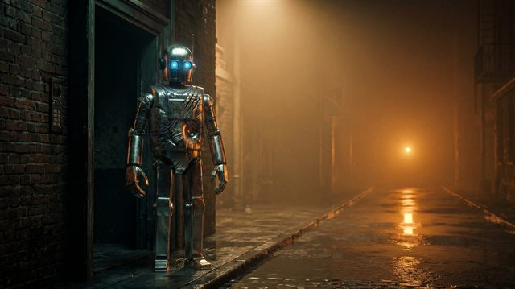
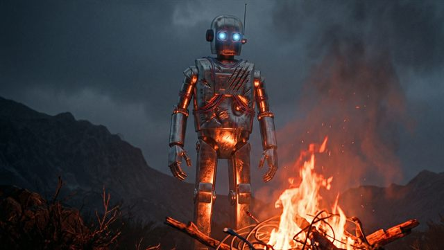
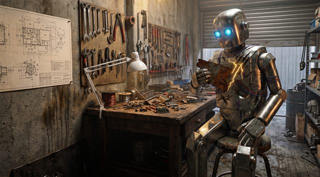

# ROBOTIKO v2.0

**A shipped, 10-episode CyberAnatolian sci-fi musical — and the open, git-native pipeline that produced it.**

> Not the first AI film tool — an open grammar for directing one, behind a shipped multi-episode series.

One human wrote the story and created a tech-art pipeline. GenAI brought it to life.

[](https://github.com/fibuladev/robotiko-v2/actions/workflows/validation_suite.yml)

---

## The character whose damage is under version control

<table>
  <tr>
    <td align="center"></td>
    <td align="center"></td>
    <td align="center"></td>
  </tr>
  <tr>
    <td align="center"><b>Phase 1 — Awakening</b></td>
    <td align="center"><b>Phase 2 — Destruction</b></td>
    <td align="center"><b>Phase 3 — Reconstruction</b></td>
  </tr>
</table>

His damage is version-controlled — every crack is a tracked state in [`_assets/cast/character_profiles.json`](_assets/cast/character_profiles.json), and CI blocks a scene that renders the wrong phase. A pristine Robotiko in EP07 is not a style choice; it is a build failure.

---

## Watch first

The films are the proof. Start here:

**► [EP01 — Two Halves of One Whole Apple](https://youtu.be/W_zfFDXn0o0)**

All ten episodes live on the channel — **[youtube.com/@fibuladev](https://www.youtube.com/@fibuladev)** — and are mapped in the episode guide below.

---

## Episode guide

Ten episodes trace one arc: a data-drunk AI is broken down and rebuilt, mapped onto the [seven stations of the Turkish wisdom tradition](_management/master.md#6-episodic-structure--the-full-map). The philosophy lives in `master.md` — this table is just the map.

| EP | Title | Station | Watch | Language / music |
|---|---|---|---|---|
| 01 | Two Halves of One Whole Apple | [The Commanding Self](_management/master.md#6-episodic-structure--the-full-map) | [YouTube](https://youtu.be/W_zfFDXn0o0) | English · Anatolian symphonic prog rock |
| 02 | The Tech Guru's Downfall | [The Commanding Self](_management/master.md#6-episodic-structure--the-full-map) | released ([channel](https://www.youtube.com/@fibuladev)) | English · Anatolian psych funk-rock |
| 03 | They Folded Him Like Cloth | [The Self-Blaming Self](_management/master.md#6-episodic-structure--the-full-map) | released ([channel](https://www.youtube.com/@fibuladev)) | Turkish · upbeat Anatolian pop-rock |
| 04 | The Moon Has No Light of Its Own | [The Inspired Self](_management/master.md#6-episodic-structure--the-full-map) | released ([channel](https://www.youtube.com/@fibuladev)) | English · Anatolian doom rock |
| 05 | A High-Voltage Fool in Love | [The Inspired Self](_management/master.md#6-episodic-structure--the-full-map) | released ([channel](https://www.youtube.com/@fibuladev)) | English · slow blues |
| 06 | His Mirror Had No Scratches | [The Tranquil Self — Broken](_management/master.md#6-episodic-structure--the-full-map) | released ([channel](https://www.youtube.com/@fibuladev)) | English · slow Anatolian power ballad |
| 07 | Everyone Is Sorry, No One Is Hiring | [The Surrendering Self](_management/master.md#6-episodic-structure--the-full-map) | released ([channel](https://www.youtube.com/@fibuladev)) | English · minimal Anatolian rock, grand piano |
| 08 | 40 Days Above the Clouds | [The Contented Self](_management/master.md#6-episodic-structure--the-full-map) | released ([channel](https://www.youtube.com/@fibuladev)) | English spoken word · Anatolian doom rock |
| 09 | Shadow Debugging | [The Integrated Self](_management/master.md#6-episodic-structure--the-full-map) | released ([channel](https://www.youtube.com/@fibuladev)) | English spoken word · sparse Anatolian textures |
| 10 | The Glitch Scripture / I Came to Walk Beside | [The Integrated Self — Arrival](_management/master.md#6-episodic-structure--the-full-map) | released ([channel](https://www.youtube.com/@fibuladev)) — the finale; its release day is the day this repo went public | English · Anatolian symphonic prog rock — the answer to EP01 |

---

## Prove it yourself

The whole method rests on one gate. Clone the repo and run it:

```
$ python tests/run_all.py --coverage
================================================================
  COVERAGE SUMMARY (from invariant_coverage_matrix.md)
================================================================
  Rows: 41   30 Machine   4 Heuristic   12 Human   1 Gap
```

The interesting part is that the suite also tells you what it does **not** guarantee. Seventeen of those forty-one invariants are not machine-enforced — four are heuristics that can misfire, twelve are human taste-gates with no automation claimed, and one is an acknowledged Gap. That honesty is the point: a green run is not a claim of perfection. Read the full ledger in [`_management/invariant_coverage_matrix.md`](_management/invariant_coverage_matrix.md), and see how a documented Gap graduates into an enforced check in [docs/method-lesson-graduation.md](docs/method-lesson-graduation.md).

The gate is real enough that a commit ([`0eb3bb4`](https://github.com/fibuladev/robotiko-v2/commit/0eb3bb4)) deliberately shipped EP09's motion script with its em-dashes intact to turn CI red on purpose — a before/after teaching artifact, not an accident.

---

## The art direction, proved on disk

You don't need YouTube to check the look. 70 curated frames are tracked in the repo — one per decisive moment — and the strongest single finding is that across EP07-EP09 **three different warm colors carry three different meanings**: EP07's amber arrives from outside (received), EP08's fire is orange-red physics (not grace), EP09's kintsugi gold is the only warmth he makes himself.

<table>
  <tr>
    <td align="center"></td>
    <td align="center"></td>
    <td align="center"></td>
  </tr>
  <tr>
    <td align="center"><b>EP07 · received amber</b></td>
    <td align="center"><b>EP08 · orange-red fire</b></td>
    <td align="center"><b>EP09 · self-made gold</b></td>
  </tr>
</table>

See the full evidence — episode by episode, the palette journeys, and the honest caveats where the frames under-deliver — in [docs/visual-canon.md](docs/visual-canon.md).

---

## What this is / What this is not

**This is** a set of reproducible *recipes*. Clone it and you get the skills, validators, templates, and stage-gates that direct a film — the method runs end to end.

**This is not** a button that re-renders the films. The final videos are generated by external tools (Suno, Nano Banana, Kling, Seedance, Veo) and live outside the tree; the repo tracks the instructions, not the gigabytes. You reproduce the *process*, not the pixels.

A few honesty notes, stated plainly because the project believes documented imperfection beats faked polish:

- **The camera hallucinates.** There is no lens, no 180-degree line the model remembers — the "look" is a prompt suffix asserted in words. This is not a "generate prompts, copy-paste, get images" pipeline. **Image generation is the hard part** — that is where the universe is created. Roughly 65–70% of visual prompts land on the first try; the remaining 30–35% will cost you time, because scene-driven prompts carry dense detail (character state, symbolic weight, camera framing, emotional tone) plus reference images, and that density can confuse generation tools. **Video generation is far more forgiving** (~80% first-pass) — the universe is already built in the image; the video just sets it in motion. The good news: concept notes and dramaturgy give you a rock-solid frame — there is no risk of drifting away from the story. The shots that need a retry usually resolve within a few attempts: simplify the prompt, swap a few words, or drop a detail the tool is misinterpreting. The result is a scene that matches the story you set out to tell — your vision, not the tool's guess. These figures are experiential observations, not instrumented telemetry — the repo says so openly. The full argument is in [docs/hallucinating-camera.md](docs/hallucinating-camera.md).
- **Three gates are human on purpose.** After dramaturgy, after reference authoring, and after the motion script, a person must approve before the pipeline continues — and each approval is recorded in [`_management/approvals.json`](_management/approvals.json) with a sha256 of the approved artifact, so post-approval drift stays visible. Taste does not automate, so the repo does not pretend it does.
- **The rules are tested, not asserted.** The lessons file carries 144 hard-won rules — e.g. never write "glowing eyes" in a prompt (generators render literal glowing eyeballs); describe the material instead: *"dark amber glass lenses set into chrome sockets, like polished gemstones."* Rules earn their place by surviving a real reshoot.

---

## By the numbers

Everything here is countable in the repo:

| | |
|---|---|
| Episodes released on YouTube | **10** (the complete arc) |
| CI check groups | **12** (11 blocking + 1 advisory) |
| Validator meta-tests (graders that grade the graders) | **245** |
| Architecture Decision Records | **12** (`_management/adr/`) |
| Commits of tracked history | **265+** (run `git rev-list --count HEAD`) |
| Tested lessons rules | **144** ([`_memory/lessons.md`](_memory/lessons.md)) |
| Total runtime, ten episodes | **69:51** (sum of the ten musical-metadata durations) |
| Full production cost | **≈ €1,360** in consumer subscriptions — disclosed line by line in [`_management/cost.md`](_management/cost.md) |

---

## Fork it — build your own universe

This repo is a blueprint. Take the pipeline, keep your own story.

- **The method is MIT-licensed** — the skills, scripts, tests, and templates are yours to fork, including commercially.
- **Start here:** [FORKING.md — your own universe in an afternoon](FORKING.md), a checklist proven against a second universe ([the timed dry run](docs/fork-dry-run.md)). Deeper rationale in [CONTRIBUTING §3](CONTRIBUTING.md#3-how-to-fork-the-method-for-your-own-universe).
- **See who already has:** [UNIVERSES.md](UNIVERSES.md) — the registry of downstream forks.

---

## Watch it being built (optional)

The pipeline itself was recorded live: **Building an AI Film Studio**, a build-along series on [youtube.com/@fibuladev](https://www.youtube.com/@fibuladev), shows EP09 produced from an empty folder to a finished film — real sessions with the bugs, the fixes, and the reasoning left in.

One thing to know before pressing play: the sessions show far more detail than the pipeline requires. On camera every prompt is spelled out and every decision reasoned aloud — that is the point of the recording, not the cost of using the method. In normal operation each stage is one trigger phrase ([docs/skills-guide.md](docs/skills-guide.md)) and the skills do the rest. Watch the series to understand *why* the pipeline is shaped the way it is; use [FORKING.md](FORKING.md) to actually run it.

---

## How it works (the short version)

A git repository operated as a one-person film studio. An LLM (Claude, via Claude Code skills) works as a stage-gated production crew; the human keeps exactly two irreplaceable powers — creative vision (the inputs) and taste (three approval gates). The music's structure drives the dramaturgy, the dramaturgy drives the visuals, and every stage is traceable: *Output of Step N = Input of Step N+1.*

The full chain, one episode: **lyrics & music** (manual — the audio stays outside the repo; only the lyrics and the timings you read off the track enter the pipeline) → `"Scaffold EP{XX}"` → `"Create musical metadata for EP{XX}"` → **concept notes** (manual) → `"Create dramaturgy for EP{XX}"` → **⛔ gate 1** → `"Generate visual prompts for EP{XX}"` → **⛔ reference gate** → **image generation** (manual) → `"Generate motion script for EP{XX}"` → **⛔ gate 2** → **video generation** (manual) → `"Edit EP{XX} in CapCut"` → `"Package EP{XX} for YouTube"`. The step-by-step walkthrough is [docs/getting-started.md](docs/getting-started.md).

```
robotiko-v2/
├── _management/        # Universe canon, pipeline rules, naming convention, architecture, ADRs
├── _assets/            # Character reference images + profiles (the state machine)
├── _skills/            # 10 Claude skills — the production crew
├── _memory/            # lessons.md (tested rules), decisions log, todo
├── _tools/mcp-gdrive/  # Custom Google Drive MCP server (binary asset archive)
├── docs/               # Getting started, the hallucinating camera, method notes
├── scripts/            # Automation (create_episode.py)
├── tests/              # Naming / pipeline / visual-prompt / motion validators
├── episode-XX/         # One episode: lyrics → music → direction → visuals → video → edit → social
└── .github/workflows/  # CI (the Validation Suite)
```

**Tech stack:** Claude (Anthropic) as director/crew · Suno + BandLab for music · Nano Banana for images · Kling / Seedance / Veo for video · CapCut for the edit · Python + GitHub Actions for the gates · Google Drive (custom MCP) for binary archive.

### Documentation

| Document | What it covers |
|---|---|
| [docs/getting-started.md](docs/getting-started.md) | Prerequisites, clone-to-first-episode walkthrough, costs, FAQ |
| [docs/anatomy-of-an-episode.md](docs/anatomy-of-an-episode.md) | EP07 traced end-to-end — the showcase artifact |
| [docs/skills-guide.md](docs/skills-guide.md) | The 10 skills, how to trigger them, a worked example |
| [docs/tools-setup.md](docs/tools-setup.md) | Per-tool setup (Claude Code, Suno, Nano Banana, Kling/Veo/Seedance, CapCut, MCP) |
| [docs/hallucinating-camera.md](docs/hallucinating-camera.md) | Why directing a model that has no lens is a real craft |
| [docs/method-lesson-graduation.md](docs/method-lesson-graduation.md) | How a lesson becomes an enforced check |
| [_management/master.md](_management/master.md) | The universe canon — source of truth for every creative decision |
| [_management/pipeline_rules.md](_management/pipeline_rules.md) | Production workflow, video strategy modes, quality gates |
| [_management/architecture.md](_management/architecture.md) | Technical stack and data flow |
| [_management/naming_convention.md](_management/naming_convention.md) | File naming standards (the pipeline's foreign keys) |

---

## Community & governance

- [CONTRIBUTING.md](CONTRIBUTING.md) — the two ways to contribute (fork the method, or improve the method)
- [GOVERNANCE.md](GOVERNANCE.md) — how decisions get made
- [ROADMAP.md](ROADMAP.md) — where this is going
- [CODE_OF_CONDUCT.md](CODE_OF_CONDUCT.md) — the ground rules
- [SECURITY.md](SECURITY.md) — reporting a vulnerability
- [AUTHOR.md](AUTHOR.md) — who Fibula is

---

## License

ROBOTIKO v2.0 is **dual-licensed**:

- **Software & method** — the skills, scripts, tests, MCP server, templates, and process docs — under the **MIT License**. See [LICENSE](LICENSE). Fork it freely, including commercially.
- **Creative content** — the lyrics, dramaturgy, the ROBOTIKO universe (`_management/master.md`), character designs, and other published creative writing — under **CC BY-NC 4.0**. See [LICENSE-CONTENT](LICENSE-CONTENT). Study it, remix it non-commercially with attribution — but tell your own story; don't sell this one.

Take the pipeline, build *your* universe.

---

## Cultural heritage

This project draws from the Turkish wisdom tradition — a centuries-old philosophical and contemplative heritage shaped by thinkers, poets, and sages who lived and taught in Anatolia: Yunus Emre, Hacı Bektaş Veli, Pir Sultan Abdal, and Mevlana. The musical foundation is 70s Turkish psychedelic rock — the legacy of Barış Manço, Cem Karaca, Erkin Koray, Fikret Kızılok, Kurtalan Ekspres, and Moğollar.

The genre label "CyberAnatolian" names the civilizational synthesis — the meeting of digital culture with the ancient Anatolian cultural basin. The cultural source is the Turkish tradition of these lands — its wisdom literature and its 70s rock.

---

*"The Moon has no light of its own. But in reflecting the Sun, it illuminates the night."*
