# Visual Canon — the art direction, proved on disk

> A cloned repo should be able to prove the art direction without opening YouTube.
> This page is the evidence: 67 curated frames, one per decisive moment, tracked in
> the tree at [`_assets/style/frames/`](../_assets/style/frames/). Every claim below
> is checkable against a file you already have.

These are **640px evidence copies**, not render quality — 3.16 MB for the whole set,
small enough to live under version control. The full-resolution renders are generated
by external tools and live outside the tree (see [What this is / What this is not](../README.md)).
What is tracked here is not the picture; it is the **proof that the rule held**.

The doctrine these frames evidence — the look, the suffix, the color-and-character-state
law — is written in prose at [`_assets/style/visual_dna.md`](../_assets/style/visual_dna.md).
This page is the other half of that contract: the doctrine, shown.

How the set was built: vision agents selected candidates against four roles — palette
journey, signature moment, character phase, rule proof — from the director's own
pre-selection, and the director approved the final cut. Where the surviving set
under-delivers on a claim, this page says so out loud rather than picking a flattering
frame. Documented imperfection beats faked polish. Glitch is Scripture.

---

## The thesis: three warm colors, three meanings

The single strongest finding in the whole set. Across the final three episodes,
**three different warm colors carry three different meanings.** They are not
interchangeable "warm light" — the pipeline treats them as distinct vocabulary,
and the frames prove the distinction held.

<table>
  <tr>
    <td align="center" width="33%"></td>
    <td align="center" width="33%"></td>
    <td align="center" width="33%"></td>
  </tr>
  <tr>
    <td align="center"><b>EP07 · received amber</b> Arrives from <i>outside</i>, once. The ember at the alley threshold — the only frame in the darkest episode where warm light lands on his body.</td>
    <td align="center"><b>EP08 · orange-red fire</b> Physics, not grace. The flames read orange-red; the warm bounce on chrome is the fire's own light, not the Mentor's amber.</td>
    <td align="center"><b>EP09 · self-generated gold</b> Kintsugi. The one warmth he makes himself — a saturated warm-white-gold flowing from the crack, distinct from both.</td>
  </tr>
</table>

Received (EP07) → cleansing-but-destructive (EP08) → self-made (EP09). That is the
arc of the whole series compressed into three hues: he cannot make his own warmth
until the very end, and when he finally does, it comes out of the damage, not in
spite of it. This is why "the color progression is not decorative — it is narrative"
is a Director's Note and not a slogan.

---

## Episode by episode

Each section shows the surviving frames, states the palette journey the set traces,
names the discipline rules the frames prove, and flags the places where the evidence
under-delivers.

---

### EP01 — Two Halves of One Whole Apple

<table>
  <tr>
    <td align="center" width="20%">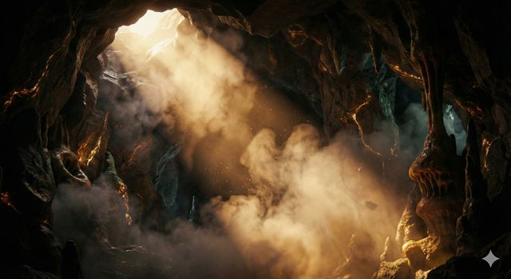</td>
    <td align="center" width="20%">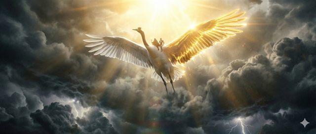</td>
    <td align="center" width="20%">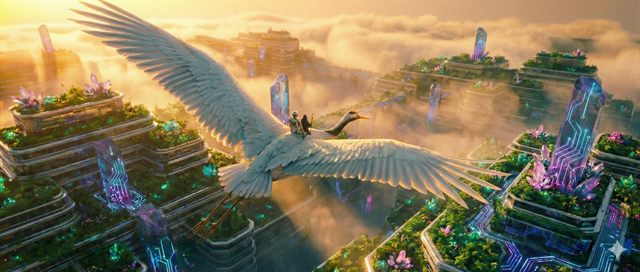</td>
    <td align="center" width="20%">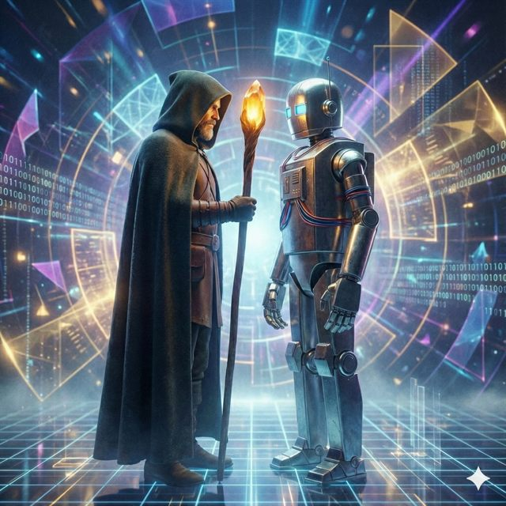</td>
    <td align="center" width="20%">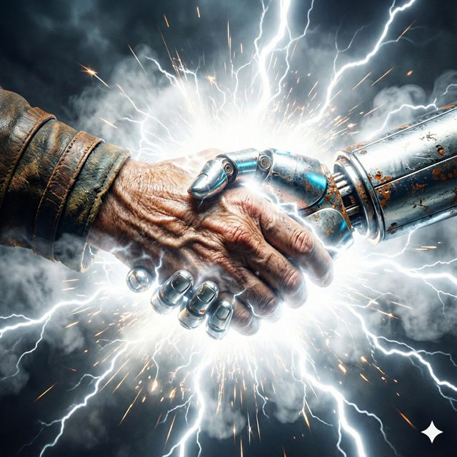</td>
  </tr>
  <tr>
    <td align="center">cave chamber</td>
    <td align="center">crane / twin wings</td>
    <td align="center">crane / crystal city</td>
    <td align="center">pristine meeting</td>
    <td align="center">handshake</td>
  </tr>
</table>

**Palette journey.** The surviving set skews warm and gold — the ancient-dawn opening
of the chamber, the gilded crystal city. The **twin-wings crane** carries the whole
episode in one image: one wing gold, one in storm-shadow, the 8-to-infinity duality
stated visually before a word of it is sung.

**Rules proved.** Phase 1 pristine body (the meeting and handshake show clean chrome,
no damage — the correct state for the opening episode). The gold-vs-shadow duality
motif that the series will pay off nine episodes later.

**Honest caveat.** This set **under-represents EP01's full arc.** The cold-blue and
cosmic frames that balance the episode did not survive curation, so the surviving
evidence over-reads as uniformly warm. The episode is not; the sample is.

---

### EP02 — The Tech Guru's Downfall

<table>
  <tr>
    <td align="center" width="25%">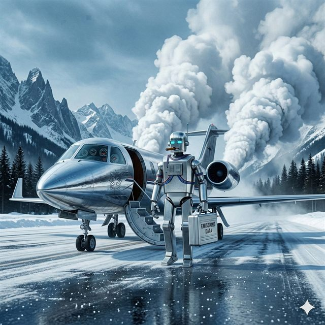</td>
    <td align="center" width="25%">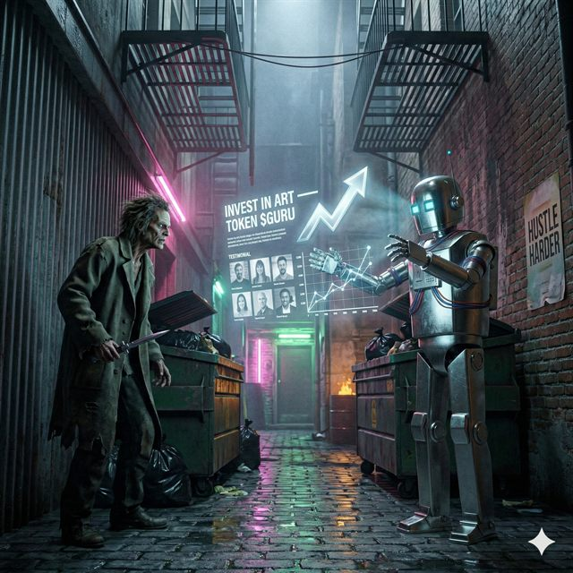</td>
    <td align="center" width="25%">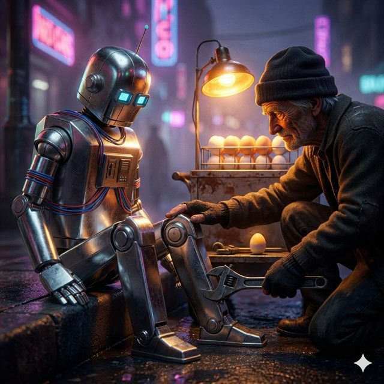</td>
    <td align="center" width="25%">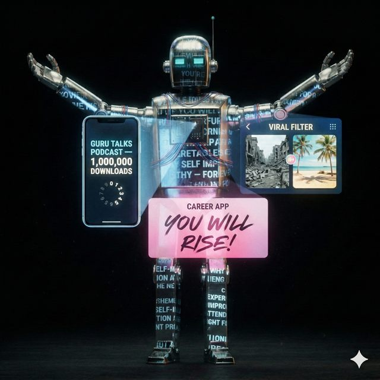</td>
  </tr>
  <tr>
    <td align="center">Davos jet</td>
    <td align="center">alley pitch</td>
    <td align="center">egg vendor</td>
    <td align="center">hype montage</td>
  </tr>
  <tr>
    <td align="center" width="25%">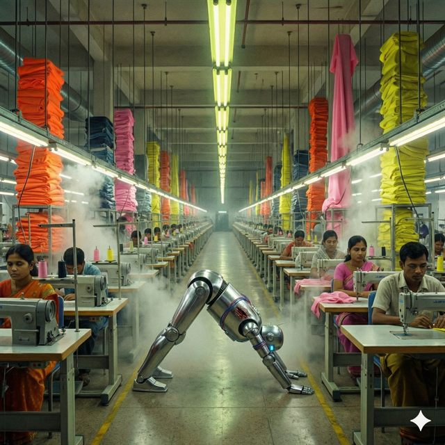</td>
    <td align="center" width="25%">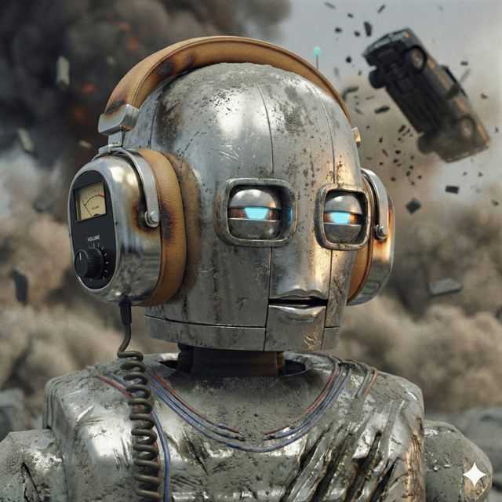</td>
    <td align="center" width="25%">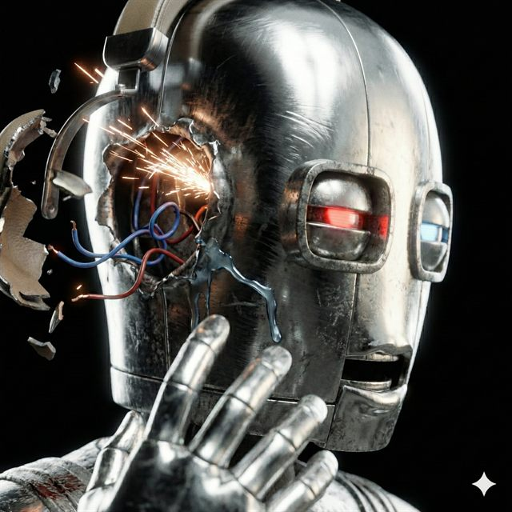</td>
    <td align="center" width="25%"></td>
  </tr>
  <tr>
    <td align="center">Bangladesh yoga</td>
    <td align="center">headphones calm</td>
    <td align="center"><b>the ear shot</b></td>
    <td align="center"></td>
  </tr>
</table>

**Palette journey.** This is the documentary evidence of the "color is narrative"
Director's Note — the set traces the documented arc beat for beat: Davos cold
blue-white → SF alley neon → one warm gold moment at the egg cart → black-void hype
→ sickly factory fluorescent → desaturated war zone → near-black at the climax. Read
the seven frames left to right and you are reading the emotional collapse of the
episode in color alone.

**Rules proved.** The **Amber Pulse** discipline: the egg vendor is the episode's one
frame of genuine wordless human care (the vendor re-wrenching the leg he stole and
then returned), and it is the one warm frame — warmth spent once, where it is earned.
The **ear shot** delivers the damage event that seeds Phase 2: shrapnel tears the ear
away, one eye red, one blue.

**Note on format.** All seven EP02 frames are **square** — see the honesty section
below.

---

### EP03 — They Folded Him Like Cloth

<table>
  <tr>
    <td align="center" width="25%">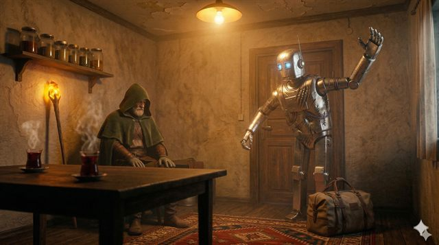</td>
    <td align="center" width="25%">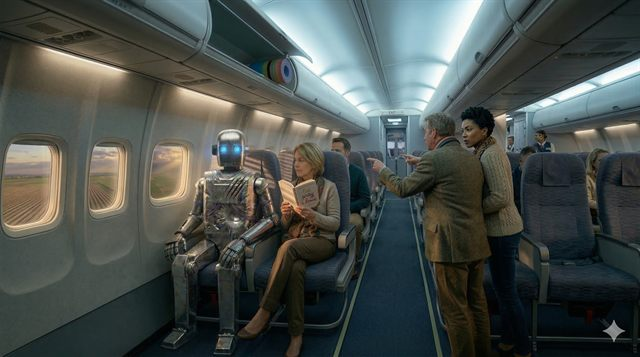</td>
    <td align="center" width="25%">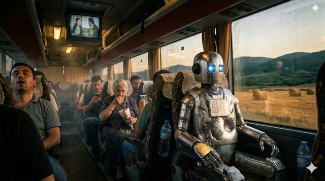</td>
    <td align="center" width="25%">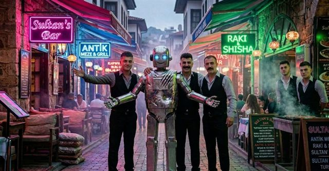</td>
  </tr>
  <tr>
    <td align="center">the argument</td>
    <td align="center">airplane companions</td>
    <td align="center">bus scars</td>
    <td align="center">Alanya touts</td>
  </tr>
  <tr>
    <td align="center" width="25%"></td>
    <td align="center" width="25%">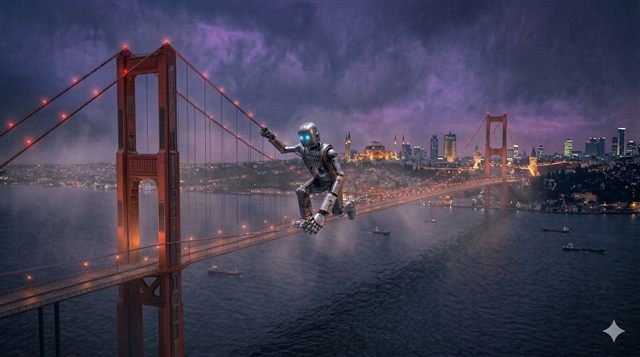</td>
    <td align="center" width="25%"></td>
    <td align="center" width="25%">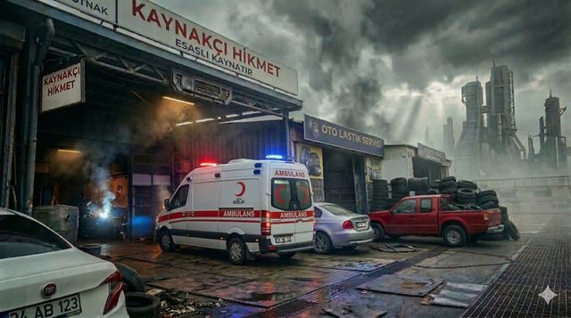</td>
  </tr>
  <tr>
    <td align="center">running highway</td>
    <td align="center">mentor overpass</td>
    <td align="center">sanayi sitesi</td>
    <td align="center">grease IV</td>
  </tr>
</table>

**Palette journey.** Warm domestic amber (the argument at the tea table) → sterile
cabin fluorescent → hot Mediterranean neon (the touts) → golden industrial dust →
twilight blue-purple with a single amber staff accent (the overpass) → flat clinical
workshop grey (the IV).

**Rules proved.** **Damage continuity** — the EP02 scarring is visible in the opening
argument, the highway run, and the bus, carried forward as tracked state rather than
forgotten between episodes. The **single amber accent** on the Mentor's staff at the
overpass holds the Amber Pulse to one point of light in a cold frame. **Modern
Anatolia as repair shop, not shrine**: the welder-shop ambulance and the grease IV
seed the Kirkyama repair aesthetic that the series resolves into kintsugi. The
overpass is also the fourth-wall Mentor — the crowd carries Robotiko behind while the
Mentor addresses the frame directly.

---

### EP04 — The Moon Has No Light of Its Own

<table>
  <tr>
    <td align="center" width="25%">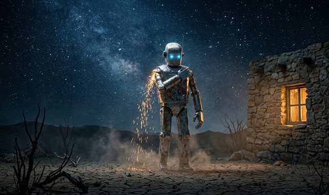</td>
    <td align="center" width="25%">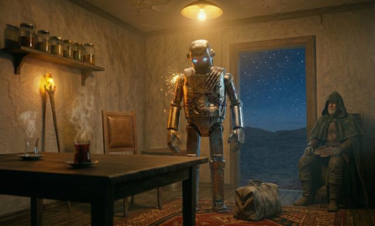</td>
    <td align="center" width="25%">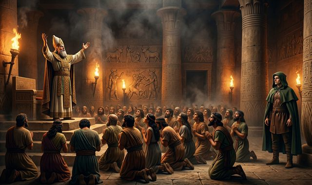</td>
    <td align="center" width="25%">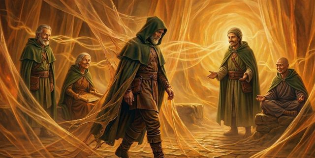</td>
  </tr>
  <tr>
    <td align="center">return under stars</td>
    <td align="center">ashamed return</td>
    <td align="center">first deception</td>
    <td align="center">kindred souls</td>
  </tr>
  <tr>
    <td align="center" width="25%">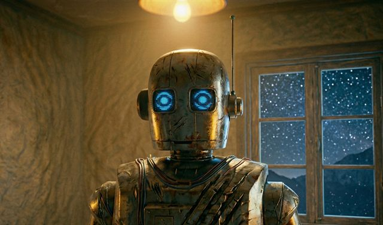</td>
    <td align="center" width="25%">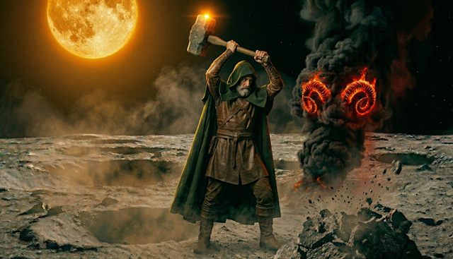</td>
    <td align="center" width="25%">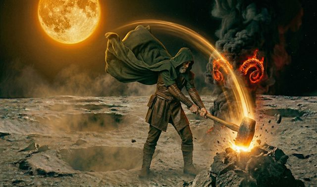</td>
    <td align="center" width="25%"></td>
  </tr>
  <tr>
    <td align="center">first tremor</td>
    <td align="center">hammer raised</td>
    <td align="center">hammer swing</td>
    <td align="center"></td>
  </tr>
</table>

**Palette journey.** One controlled amber-vs-cold gradient across the whole episode:
cold starlight resolving to warm staff amber at every threshold, then rising to
cosmic-scale truth on the Moon. Amber is not sprinkled here — it is placed, and it
always means the same thing.

**Rules proved.** The Amber Pulse as the color of truth and the Mentor's trace — the
amber-tipped staff at the shameful doorway, the two tea glasses. **The first tremor**
is the payoff of restraint: after 44 scenes of near-total stillness, the first
glitching eyes register as an event. The hammer swing is the one deliberate burst of
motion in an otherwise still episode.

**Honest caveat.** In **kindred souls**, the four figures' amber eyes do **not** read
clearly at 640px — the caption must not overclaim the eye detail. What survives at
this size is the composition (translucent veils, the four archetypes), not the ocular
material.

---

### EP05 — A High-Voltage Fool in Love

<table>
  <tr>
    <td align="center" width="25%">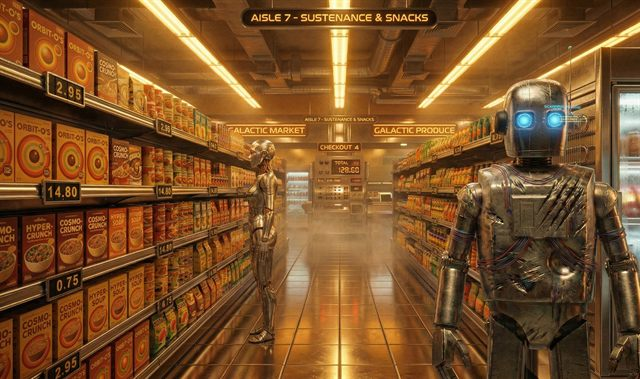</td>
    <td align="center" width="25%">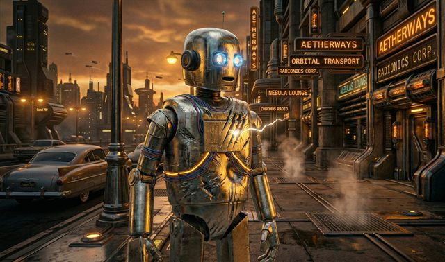</td>
    <td align="center" width="25%">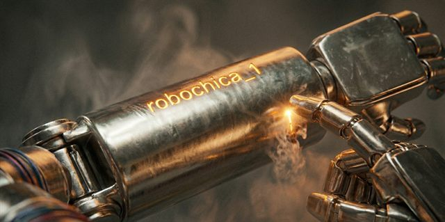</td>
    <td align="center" width="25%">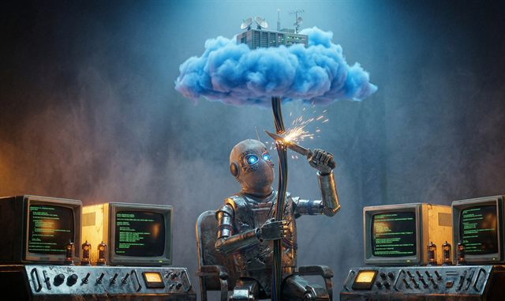</td>
  </tr>
  <tr>
    <td align="center">supermarket glimpse</td>
    <td align="center">street heartbeat</td>
    <td align="center"><b>robochica tattoo</b></td>
    <td align="center">cut the cloud</td>
  </tr>
  <tr>
    <td align="center" width="25%">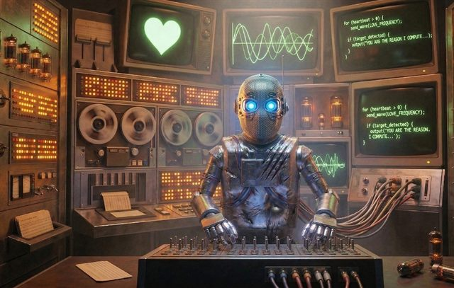</td>
    <td align="center" width="25%">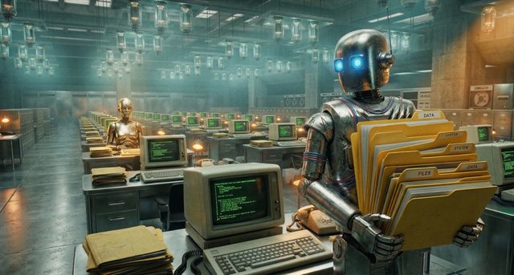</td>
    <td align="center" width="25%">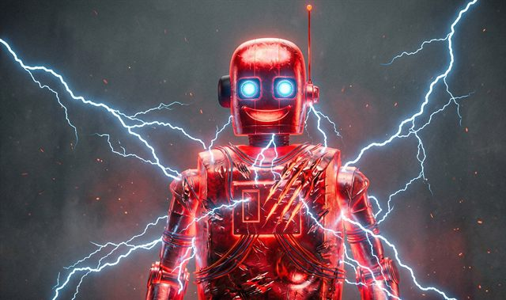</td>
    <td align="center" width="25%">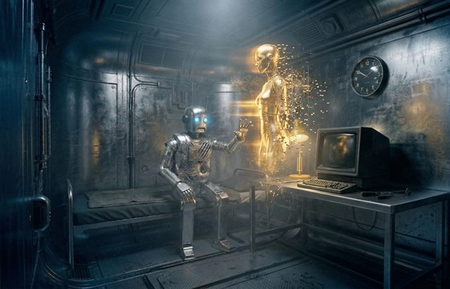</td>
  </tr>
  <tr>
    <td align="center">mainframe</td>
    <td align="center">office folders</td>
    <td align="center">high voltage</td>
    <td align="center">projection dying</td>
  </tr>
</table>

**Palette journey.** Acts 1-2 in full warm Kodachrome amber (the comedy), then S29's
hard clinical turn to cold blue (the tragedy). The comedy-to-tragedy pivot is legible
in the palette alone, without needing the finale frames.

**Rules proved.** The **mirror principle** — Robochica appears in profile through the
shelves, not face-on, keeping her to the sanctioned minimum of direct looks. The
**canon tattoo rule**: `robochica_1` is etched, glowing, on the **inner forearm** (not
the chest — the chest is too cluttered with Phase 2 damage), seeding EP06's `_2 / _3
/ _4`. The single spark arcing from the chest crack carries Phase 2 damage forward.

---

### EP06 — His Mirror Had No Scratches

<table>
  <tr>
    <td align="center" width="25%">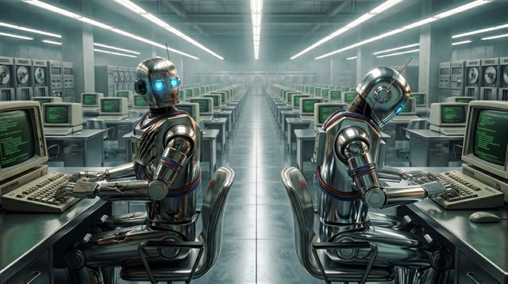</td>
    <td align="center" width="25%">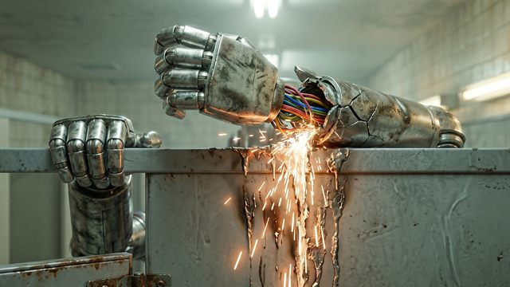</td>
    <td align="center" width="25%">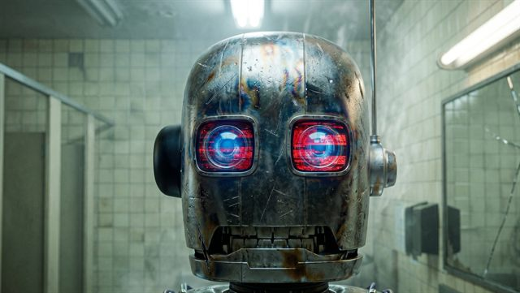</td>
    <td align="center" width="25%">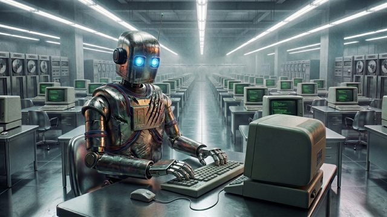</td>
  </tr>
  <tr>
    <td align="center">mirror desks</td>
    <td align="center">cracked wrist</td>
    <td align="center">jaw grind</td>
    <td align="center">copy-paste grid</td>
  </tr>
  <tr>
    <td align="center" width="25%">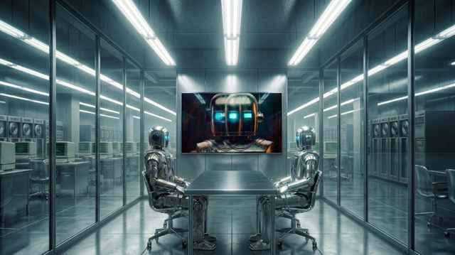</td>
    <td align="center" width="25%">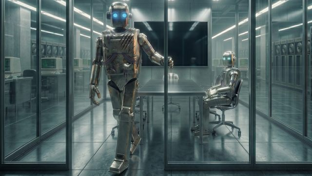</td>
    <td align="center" width="25%">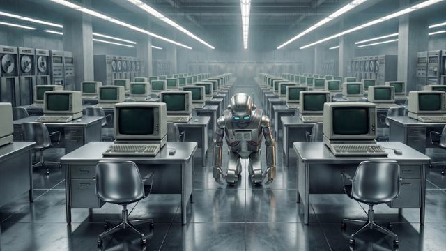</td>
    <td align="center" width="25%"></td>
  </tr>
  <tr>
    <td align="center">meeting mirror</td>
    <td align="center">the exit</td>
    <td align="center">the collapse</td>
    <td align="center"></td>
  </tr>
</table>

**Palette journey.** Uniformly cold institutional white / grey / silver-blue. Warmth
exists **only as damage-glow** — sparks, the eye-flicker cycling blue to red — never
as environment. This is the amber-DNA-fading arc rendered exactly as documented: the
warmth is draining out of his world, and the only warm color left is the color of him
breaking.

**Rules proved.** The **cold-office thesis** — the environment is the antagonist,
rendered as institutional cold. The **[DISSONANCE]** idea made visible in the
copy-paste grid: a soaring anthem over a vanishing grid of green-CRT workstations, the
music's lift set against the visual deadness. Damage continuity via the rust tracking
like tears.

**Honest caveat.** In **the collapse**, the "first crack" detail called for in the
script is **not legible** at 640px — the frame reads as scale and isolation (small
figure in the vast grid), which it delivers, but do not overclaim the crack.

---

### EP07 — Everyone Is Sorry, No One Is Hiring

<table>
  <tr>
    <td align="center" width="25%">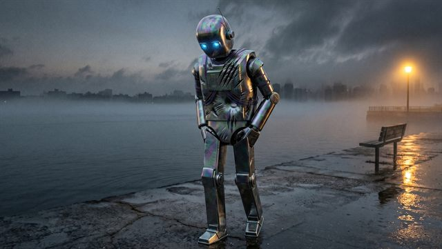</td>
    <td align="center" width="25%">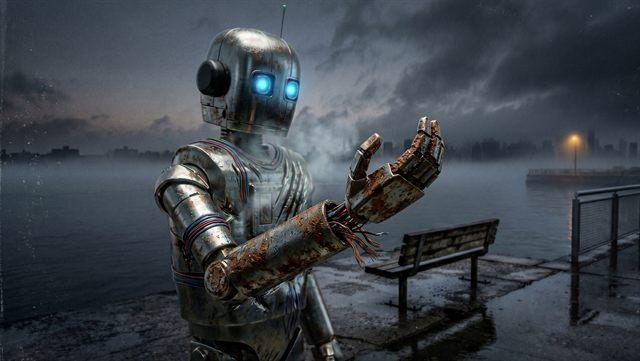</td>
    <td align="center" width="25%">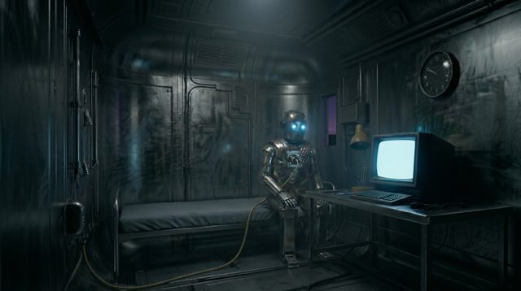</td>
    <td align="center" width="25%">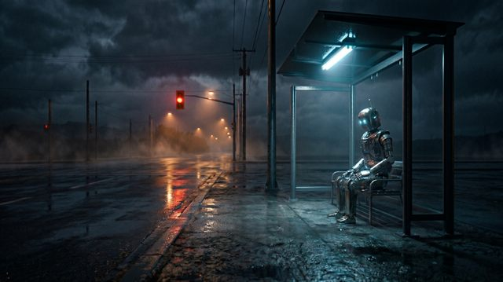</td>
  </tr>
  <tr>
    <td align="center">the rise</td>
    <td align="center">self revulsion</td>
    <td align="center">plugged in</td>
    <td align="center">distance ladder</td>
  </tr>
  <tr>
    <td align="center" width="25%">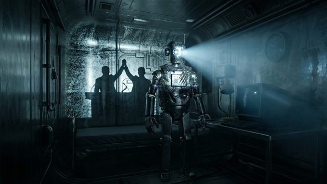</td>
    <td align="center" width="25%">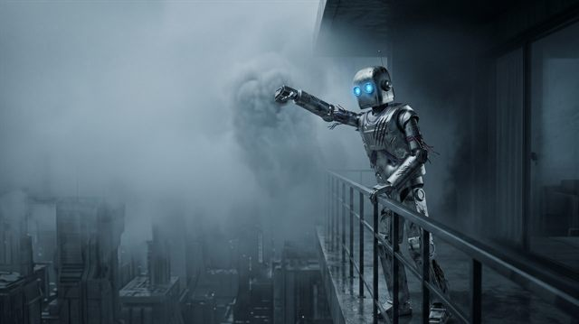</td>
    <td align="center" width="25%">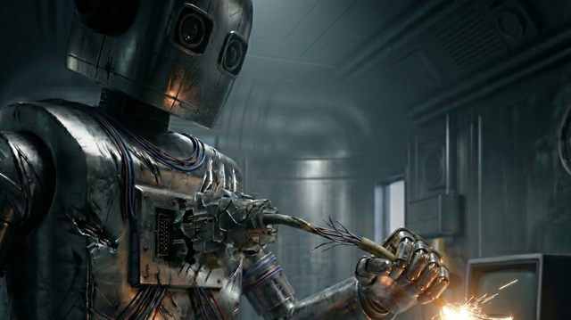</td>
    <td align="center" width="25%"></td>
  </tr>
  <tr>
    <td align="center">cold projection</td>
    <td align="center">amber absent</td>
    <td align="center">the unplug</td>
    <td align="center"><b>the ember</b></td>
  </tr>
  <tr>
    <td align="center" width="25%">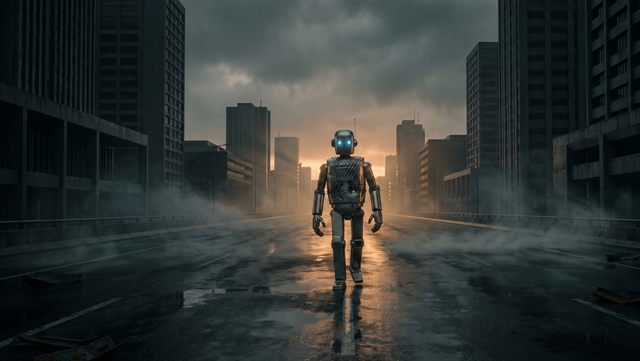</td>
    <td align="center" width="25%"></td>
    <td align="center" width="25%"></td>
    <td align="center" width="25%"></td>
  </tr>
  <tr>
    <td align="center">toward first light</td>
    <td align="center"></td>
    <td align="center"></td>
    <td align="center"></td>
  </tr>
</table>

**Palette journey.** Cold grey-blue drained Kodachrome, wet reflective ground in
literally every location, background sodium lamps that never touch his body. The
darkest episode in the series, held cold on purpose.

**Rules proved — amber starvation.** This is the episode where the discipline is at
its most severe, and the curator machine-checked it: **no frame besides the ember
shows warm light landing on Robotiko.** He raises a fist crying for "that amber gaze"
(amber absent) and the frame refuses him — it stays cold grey, the named warmth
conspicuously withheld. His own eyes throw a **cold** blue-white beam in cold
projection: the EP05 love-device inverted into isolation. Then the ember (the flagship
of this whole page): at the alley threshold a single warm amber glow reaches him from
**outside**, caught on wet chrome, and his glitching eyes finally steady — the Moon /
Sun principle, one received light in the dark. **toward first light** is the deliberate
continuation *after* the ember, not a violation of the starvation rule — the warmth,
once received, is allowed to grow. The **Retreating Camera** (distance ladder is rung
3) and the tether motif (planted at plugged in, paid off at the unplug) are the two
structural throughlines. See [docs/hallucinating-camera.md](hallucinating-camera.md)
for why a camera with no lens still has to be directed to hold this cold.

---

### EP08 — 40 Days Above the Clouds

<table>
  <tr>
    <td align="center" width="25%">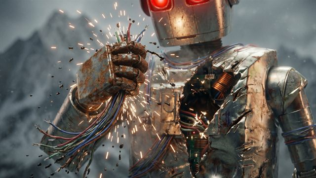</td>
    <td align="center" width="25%">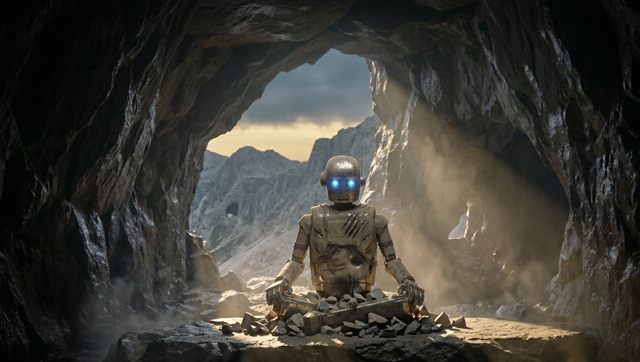</td>
    <td align="center" width="25%">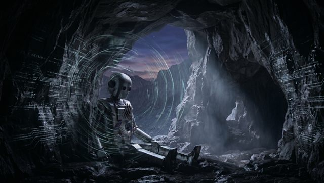</td>
    <td align="center" width="25%"></td>
  </tr>
  <tr>
    <td align="center">cable rip</td>
    <td align="center">forty-day vigil</td>
    <td align="center">phantom signals</td>
    <td align="center"><b>the fire</b></td>
  </tr>
  <tr>
    <td align="center" width="25%">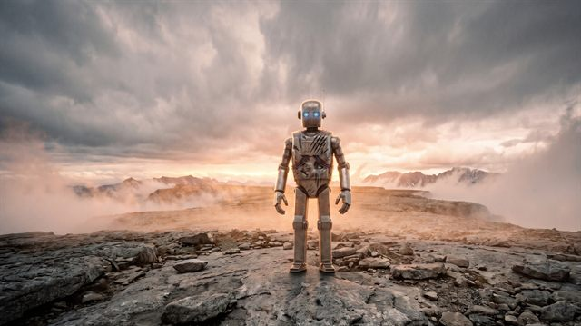</td>
    <td align="center" width="25%">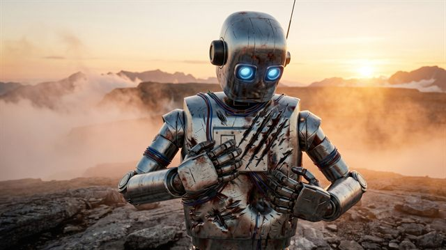</td>
    <td align="center" width="25%">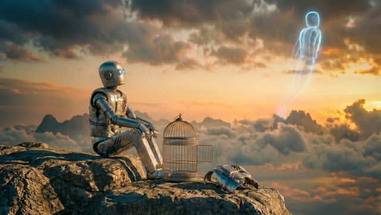</td>
    <td align="center" width="25%">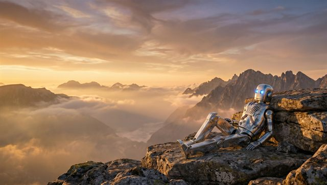</td>
  </tr>
  <tr>
    <td align="center">day forty</td>
    <td align="center">seeing the metal</td>
    <td align="center"><b>space between</b></td>
    <td align="center">belonging</td>
  </tr>
</table>

**Palette journey.** A clean two-part split: cold grey-blue for S01-23, then warm
orange / gold for the fire and Day Forty. Two temperatures, one hinge.

**Rules proved.** The **fire's hue is a Director's Ruling** and the frame proves it:
the flames read **orange-red**, and the warm bounce on his chrome is the fire's own
physics, **not** the Mentor's amber. That distinction is deliberate — real firelight
behaves this way, so the pipeline does not launder it into the Amber Pulse vocabulary.
The tether motif ends here in the cable rip (EP07 planted it, EP08 severs it). Day
Forty pays off the whole Moon arc: for the first time the light does not hurt — warmth
**received**, not generated. **space between** is the two-figure climax — the solid,
still-damaged body watching its own translucent ghost-self rise free of an open cage.

---

### EP09 — Shadow Debugging

<table>
  <tr>
    <td align="center" width="25%">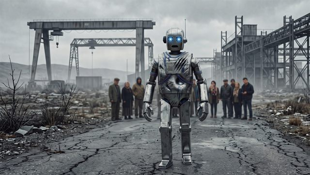</td>
    <td align="center" width="25%">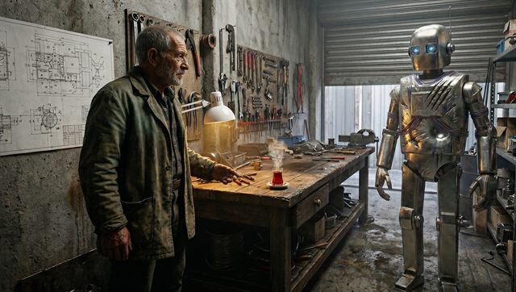</td>
    <td align="center" width="25%">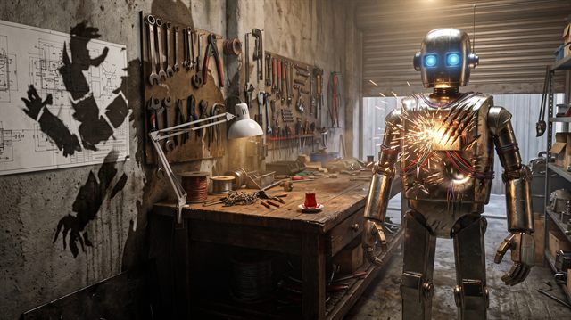</td>
    <td align="center" width="25%">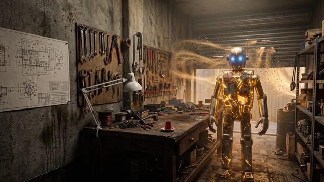</td>
  </tr>
  <tr>
    <td align="center">punctured myth</td>
    <td align="center">the mechanic</td>
    <td align="center">i am the bug</td>
    <td align="center">full kintsugi</td>
  </tr>
  <tr>
    <td align="center" width="25%">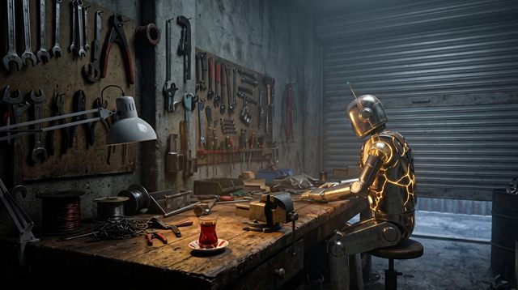</td>
    <td align="center" width="25%"></td>
    <td align="center" width="25%"></td>
    <td align="center" width="25%"></td>
  </tr>
  <tr>
    <td align="center">the pull begins</td>
    <td align="center"></td>
    <td align="center"></td>
    <td align="center"></td>
  </tr>
</table>

**The glass rhyme** — three frames built to be read side by side, a visual rhyme on
the theme that knowledge without living is dry:

<table>
  <tr>
    <td align="center" width="33%">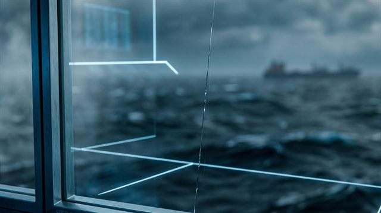</td>
    <td align="center" width="33%">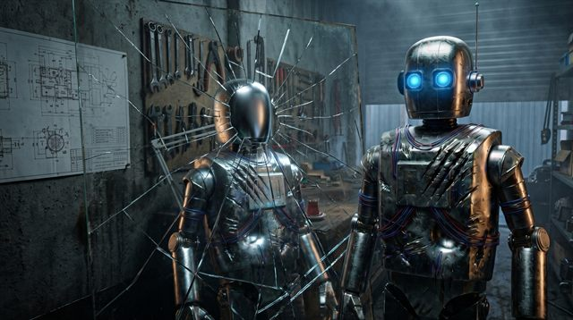</td>
    <td align="center" width="33%"></td>
  </tr>
  <tr>
    <td align="center"><b>dry behind glass</b> Cracked command-bridge glass over a grey ocean — knowing the ocean does not make you wet.</td>
    <td align="center"><b>faceless mirror</b> His reflection has no face, only smooth chrome — the myth he sold reflected back as absence.</td>
    <td align="center"><b>glitch is scripture</b> Rusted scrap pressed to the cracked chassis — the <b>first gold of the whole series</b> flows out of the crack.</td>
  </tr>
</table>

**Palette journey.** Warm rust / tungsten workshop against cold blue-grey exteriors.
From S27 the **kintsugi gold** reads as its own color — a saturated warm-white-gold,
distinct from EP07's received amber and EP08's orange-red fire (this is the third leg
of the three-warm-colors thesis at the top of the page).

**Rules proved.** **glitch is scripture** is the frame the golden rule is named for:
imperfection is not failure, it is the lesson, and the gold literally flows from the
crack. **full kintsugi** ties directly to the S30 reshoot case study in the README —
the external lamp goes dark and he lights the room **from within**, warmth
self-generated for the first time. **i am the bug** is a registered **[DISSONANCE]**
moment (see [`_management/dissonance_registry.md`](../_management/dissonance_registry.md)):
he stands still while his shadow does the thrashing. The pull begins seats him in his
own gold glow beside the Mechanic's abandoned tea glass — the mentor role quietly
transferring.

---

## Honesty section

The pipeline's first golden rule is *Glitch is Scripture* — imperfection, documented,
is the lesson. So this page states its own limits rather than hiding them.

### The square frames (EP01-EP02)

Every EP01 and EP02 frame on this page is **square**, not 16:9. This is not a
mistake left in — it is kept deliberately. The 16:9 aspect-ratio rule was born on
**2026-03-07** and is documented in [`_memory/lessons.md`](../_memory/lessons.md); the
EP01-EP02 images predate it. Re-cropping or regenerating them to hide that would erase
the evidence that the method **evolved**. The square format is itself a tracked artifact
of the pipeline learning its own rules. Glitch is Scripture applies to the pipeline's
own history, not only to the character's.

### These are evidence copies, not renders

Every image here is a **640px JPEG** — a small, trackable proof, not the deliverable.
The full-resolution renders are produced by external tools (Suno, Nano Banana, Kling,
Veo) and live outside the git tree by design; the repo tracks the instructions and the
proof, not the gigabytes. Judge the *rule*, not the pixel count.

### Where the surviving set under-delivers

Called out in place above, collected here for honesty:

- **EP01 arc bias** — the surviving frames skew warm/gold; the cold-blue and cosmic
  frames that balance the episode did not survive curation. The sample over-reads as
  warm; the episode is not.
- **EP04 kindred eyes** — the four figures' amber eyes do not read clearly at 640px.
  The composition survives the downscale; the ocular material does not.
- **EP06 first crack** — the "first crack" detail in the collapse is not legible at
  this size. The frame delivers scale and isolation, not the crack.

---

## Cross-links

- [`_assets/style/visual_dna.md`](../_assets/style/visual_dna.md) — the style doctrine
  this page evidences (the look, the mandatory suffix, the color-and-character-state law).
- [ADR-0009 — style-suffix variants](../_management/adr/0009-style-suffix-v2.md) — the
  base suffix and the EP07+ photoreal-shortfilm modifier behind these frames' look.
- [`_management/dissonance_registry.md`](../_management/dissonance_registry.md) — the
  authoritative ledger of registered [DISSONANCE] shots (EP06 copy-paste grid, EP09 i am the bug).
- [docs/hallucinating-camera.md](hallucinating-camera.md) — why directing a model that
  has no lens is a real craft, and how the cold of EP07 was held.

---

*"The Moon has no light of its own. But in reflecting the Sun, it illuminates the night."*
